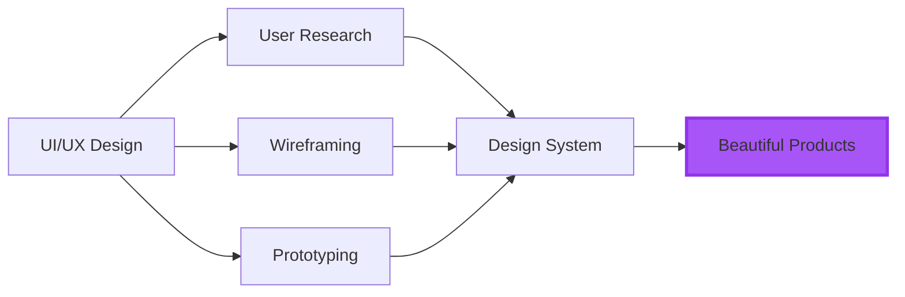

# Hi there, I'm Mishara Sanadali 👋

<div align="center">
  
</div>

<p align="center">
  
</p>

## 🎨 About Me

```typescript
const mishara = {
    location: "Sri Lanka 🇱🇰",
    education: "IJSE - Institute of Software Engineering",
    focus: ["UI/UX Design", "User Experience", "Visual Design"],
    currentlyLearning: ["Advanced Figma", "Motion Design", "Design Systems"],
    passion: "Creating intuitive and delightful user experiences",
    funFact: "I believe every pixel matters! ✨"
};
```

- 🎓 Undergraduate student at **IJSE**
- 🎨 Passionate about **UI/UX Design** and creating seamless digital experiences
- 💡 Always exploring new design trends and tools
- 🌱 Currently diving deep into **Design Thinking** and **User Research**
- 🎯 Goal: Become a leading UI/UX designer in the tech industry

## 🛠️ Design & Development Tools

<div align="center">

### 🎨 Design Tools


### 💻 Development


### 🔧 Other Tools


</div>

## 📊 GitHub Stats

<div align="center">
  
  
</div>

<div align="center">
  
</div>

## 🎯 Design Philosophy

<div align="center">

```
┌─────────────────────────────────────────┐
│  "Design is not just what it looks      │
│   like and feels like. Design is        │
│   how it works."                        │
│                      - Steve Jobs       │
└─────────────────────────────────────────┘
```

</div>

### My Approach:
- 🔍 **Research First**: Understanding user needs and pain points
- 🎨 **Visual Excellence**: Creating aesthetically pleasing interfaces
- ⚡ **Performance**: Ensuring fast and smooth interactions
- ♿ **Accessibility**: Designing for everyone
- 🔄 **Iterate**: Continuous improvement based on feedback

## 🌟 Current Focus



## 📫 Let's Connect!

<div align="center">

[](https://linkedin.com/in/yourprofile)
[](https://behance.net/yourprofile)
[](https://dribbble.com/yourprofile)
[](https://instagram.com/yourprofile)
[](mailto:your.email@example.com)

</div>

---

<div align="center">
  
  
  ### ✨ Thanks for visiting! Feel free to explore my repositories ✨
  
  
  
</div>
