<div align="center">

# 👋 Hello, I'm Mishara Sanadali


[]()
[]()
[]()
[]()


</div>

---

## 🎯 About Me

```javascript
const mishara = {
    role: "UI/UX Designer & Frontend Developer",
    location: "Colombo, Sri Lanka 🇱🇰",
    education: {
        institute: "IJSE - Institute of Software Engineering",
        status: "Undergraduate"
    },
    specialties: [
        "UI/UX Design",
        "Frontend Development",
        "Responsive Design",
        "Design Systems"
    ],
    currentMission: "Building beautiful, user-centric digital products",
    workflow: "Design → Prototype → Code → Ship 🚀",
    lifePhilosophy: "Design with empathy, code with passion"
};
```

<div align="center">

### 🎨 Design Meets Code

I bridge the gap between **design and development**, creating interfaces that are not only visually stunning but also highly functional and user-friendly. My passion lies in transforming complex problems into simple, elegant solutions.

</div>

---

## 💼 Tech Stack

<div align="center">

### 🎨 Design Tools


### 💻 Frontend Development


### 🛠️ Tools & Workflow


</div>

---

## 📊 GitHub Analytics

<div align="center">
  
  
</div>

<div align="center">
  
</div>

<div align="center">
  
</div>

---

## 🎨 Design Process

```mermaid
%%{init: {'theme':'dark', 'themeVariables': { 'primaryColor':'#6366F1'}}}%%
graph LR
    A[🔍 Research] --> B[💡 Ideate]
    B --> C[✏️ Wireframe]
    C --> D[🎨 Design]
    D --> E[🔄 Prototype]
    E --> F[💻 Develop]
    F --> G[🧪 Test]
    G --> H[🚀 Deploy]
    H --> I[📊 Iterate]
    I --> A
    
    style A fill:#6366F1,stroke:#4F46E5,color:#fff
    style B fill:#8B5CF6,stroke:#7C3AED,color:#fff
    style C fill:#A855F7,stroke:#9333EA,color:#fff
    style D fill:#C084FC,stroke:#A855F7,color:#fff
    style E fill:#6366F1,stroke:#4F46E5,color:#fff
    style F fill:#8B5CF6,stroke:#7C3AED,color:#fff
    style G fill:#A855F7,stroke:#9333EA,color:#fff
    style H fill:#C084FC,stroke:#A855F7,color:#fff
    style I fill:#6366F1,stroke:#4F46E5,color:#fff
```



---

## 🏆 Achievements & Highlights

<div align="center">

| 🎯 **Focus Areas** | 📈 **Progress** |
|:------------------:|:---------------:|
| UI/UX Projects |  |
| Frontend Development |  |
| Design Systems |  |
| Responsive Design |  |

</div>

---

## 💡 Design Philosophy

<div align="center">

```
╔═══════════════════════════════════════════════════════════╗
║                                                           ║
║   "Good design is obvious. Great design is transparent."  ║
║                                                           ║
║           - Joe Sparano                                   ║
║                                                           ║
╚═══════════════════════════════════════════════════════════╝
```

### Core Principles

🎯 **User-Centered** • 🎨 **Aesthetically Pleasing** • ⚡ **Performance-Focused**

♿ **Accessible** • 📱 **Responsive** • 🔄 **Iterative**

</div>

---

## 🌟 What I'm Up To

<div align="center">

| 🔭 Currently Working On | 🌱 Currently Learning | 👯 Looking to Collaborate On |
|:-----------------------:|:---------------------:|:---------------------------:|
| Building design systems & component libraries | Advanced animation techniques & Framer Motion | Innovative UI/UX projects & open-source |
| Creating responsive web applications | React performance optimization | Creative web experiments |
| Designing user-centered interfaces | Design thinking methodologies | Frontend challenges |

</div>

---

## 📫 Let's Connect & Collaborate

<div align="center">

I'm always excited to connect with fellow designers, developers, and creative minds! Whether you want to discuss design trends, collaborate on a project, or just chat about tech, feel free to reach out.

[](mailto:your.email@example.com)
[](https://linkedin.com/in/yourprofile)
[](https://behance.net/yourprofile)
[](https://dribbble.com/yourprofile)
[](https://twitter.com/yourprofile)
[](https://instagram.com/yourprofile)

</div>

---

<div align="center">

### 💜 Thanks for stopping by!


**⭐ Star my repositories if you find them interesting!**


---


</div>
