<div align="center">


<p>


</p>
</div>

---

## 🎨 About Me


```javascript
const mishara = {
    name: "Mishara Sandali",
    pronouns: "She/Her",
    location: "Sri Lanka 🇱🇰",
    education: {
        institute: "IJSE - Institute of Software Engineering",
        status: "Undergraduate Student 🎓"
    },
    currentFocus: [
        "UI/UX Design 🎨",
        "Frontend Development 💻",
        "User Experience Research 🔍",
        "Design Systems 🎯"
    ],
    passions: [
        "Creating beautiful interfaces",
        "Solving design problems",
        "Learning new technologies",
        "Building user-centric products"
    ],
    funFact: "I turn coffee ☕ into code and designs! ✨"
};
```

<br clear="right"/>

- 🎓 Currently studying at **IJSE - Institute of Software Engineering**
- 🎨 Passionate about **UI/UX Design** and **Frontend Development**
- 💡 Love combining **creativity** with **functionality**
- 🌱 Always learning and exploring new design trends
- 🎯 Goal: Create impactful digital experiences
- 📫 Reach me at **misharasandali@gmail.com**

---

## 🏆 GitHub Trophies

<div align="center">

[](https://github.com/ryo-ma/github-profile-trophy)

</div>

---

## 💻 Tech Stack & Tools

<div align="center">

### 🎨 Design Tools


### 💻 Frontend Development


### 🔧 Backend & Database


### 🛠️ Tools & Others


</div>

---

## 📊 GitHub Statistics

<div align="center">


</div>

<div align="center">


</div>

<div align="center">


</div>

---

🎯 Design Philosophy
<div align="center">

💭 What Drives My Work
<table>
<tr>
<td align="center" width="50%">

<h3>✨ Beautiful & Functional</h3>
<p><i>"Design is not just what it looks like and feels like.<br/>Design is how it works."</i></p>
<p><b>- Steve Jobs</b></p>
</td>
<td align="center" width="50%">

<h3>🎨 User-First Approach</h3>
<p><i>"Good design is obvious.<br/>Great design is transparent."</i></p>
<p><b>- Joe Sparano</b></p>
</td>
</tr>
</table>
```

### My Approach

🎨 **User-Centered Design** • ⚡ **Performance** • ♿ **Accessibility** • 📱 **Responsive**

</div>

---

## 🌟 Current Journey

```mermaid
%%{init: {'theme':'dark', 'themeVariables': { 'primaryColor':'#FF6EC7'}}}%%
graph LR
    A[🎓 Learning] --> B[🎨 Designing]
    B --> C[💻 Developing]
    C --> D[🚀 Deploying]
    D --> E[📈 Growing]
    E --> A
    
    style A fill:#FF6EC7,stroke:#E91E63,color:#fff
    style B fill:#9C27B0,stroke:#7B1FA2,color:#fff
    style C fill:#673AB7,stroke:#512DA8,color:#fff
    style D fill:#3F51B5,stroke:#303F9F,color:#fff
    style E fill:#2196F3,stroke:#1976D2,color:#fff
```



---

## 🎨 Design Process Visualization

<div align="center">

| Phase | Focus | Tools |
|:-----:|:-----:|:-----:|
| 🔍 **Research** | User needs & pain points | Surveys, Interviews |
| ✏️ **Wireframe** | Low-fidelity layouts | Figma, Adobe XD |
| 🎨 **Design** | High-fidelity mockups | Figma, Photoshop |
| 🔄 **Prototype** | Interactive demos | Figma |
| 💻 **Develop** | Code implementation | HTML, CSS, JS |
| 🧪 **Test** | Usability testing | User feedback |
| 🚀 **Launch** | Product deployment | GitHub, Vercel |

</div>

---

## 🎯 Skills Progress

<div align="center">

| Skill | Proficiency |
|:------|:----------:|
| **UI/UX Design** |  |
| **HTML & CSS** |  |
| **JavaScript** |  |
| **React** |  |
| **Java** |  |
| **Figma** |  |

</div>

---

## 🤝 Let's Connect!

<div align="center">

I'm always excited to connect with fellow designers, developers, and creative minds! 
Whether it's about a project collaboration, design feedback, or just a friendly chat about tech - feel free to reach out! 💬

### 📬 Contact Me

[](mailto:misharasandali@gmail.com)
[]()
[](https://fb.com/mishara%20de%20silva)
[]()

</div>

---

## 💖 Support My Work

<div align="center">

If you like my work, consider giving a ⭐ to my repositories!

[]()

</div>

---

<div align="center">

### ✨ "Design is thinking made visual" ✨


**⭐ Star my repos • 🍴 Fork them • 📬 Get in touch!**

</div>
